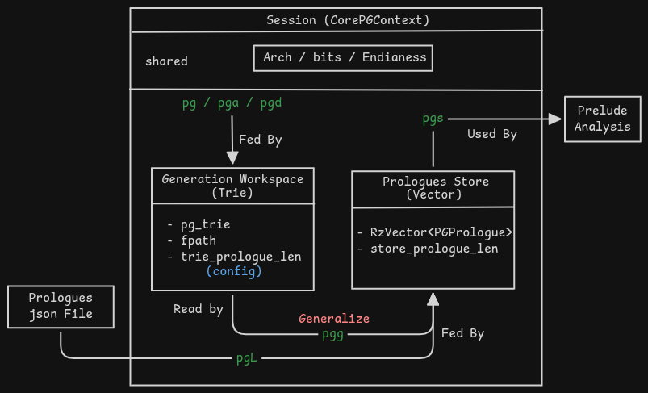

TODO: have to write more things yet (will be complete in 3-4 hours)

GSoC 2026: Function Prologues Generation Plugin for Rizin

In context of Rizin, _Prelude_ and _Prologue_ are used interchangebly. Although Prologue is the more widely used term generally. Hence I have used _Prologues_ terminology for the Plugin and the legacy naming of analysis system (analyze preludes) is kept as it is.

## The problem

A common problem in binary analysis is function detection. One method is searching for function prologues. Prologues are a sequence of instructions commonly found at the beginning of a function. These prologues perform tasks like setting up the stack, or initializing registers to values as defined in the architecture’s ABI. It is very common to hard-code these prologues patterns and match instructions against them. These patterns get outdated, are tedious to update, and have to be written for each architecture. Also because these signatures are generic, they are highly prone to false positives especially on x86/x86_64 binaries. 

This project augments static signature based approach with a dynamic, multi-stage statistical heuristic pipeline. 
So that reverse engineers and researchers can extract function prologues signatures from a binary having symbol information and use them to analyse another stripped binary (does not have symbol information). This provides a good enough baseline for function detections particularly detecting functions not in normal control flow like an orphaned function

## Solution (Design and Algorithm)

This can be split into 2 categories:

1. The mathematical solution and algorithm
2. The system design of the plugin and utility

### Mathematical solution and Algorithm

### The system design of the plugin and utility

![New Ephemeral System Design]

## Current State
## Left to do (future)
## Links to relevant work
- [Prefix Tree (Trie) Library](https://github.com/rizinorg/rizin/pull/6638) #Merged
- [Prologues Generation Plugin](https://github.com/rizinorg/rizin/pull/6514) #Under Review

## Challenges faced
## Thanks
